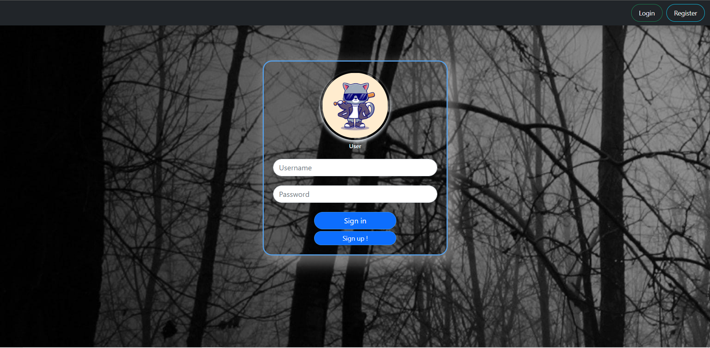
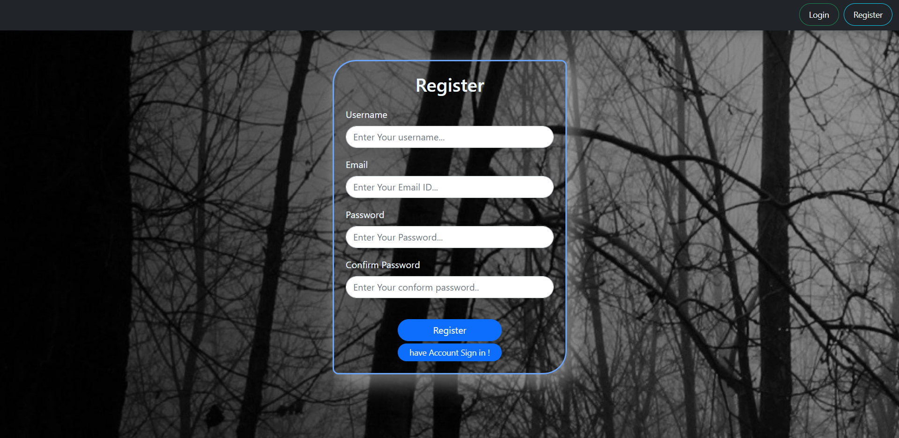
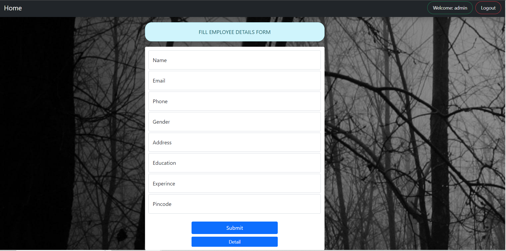
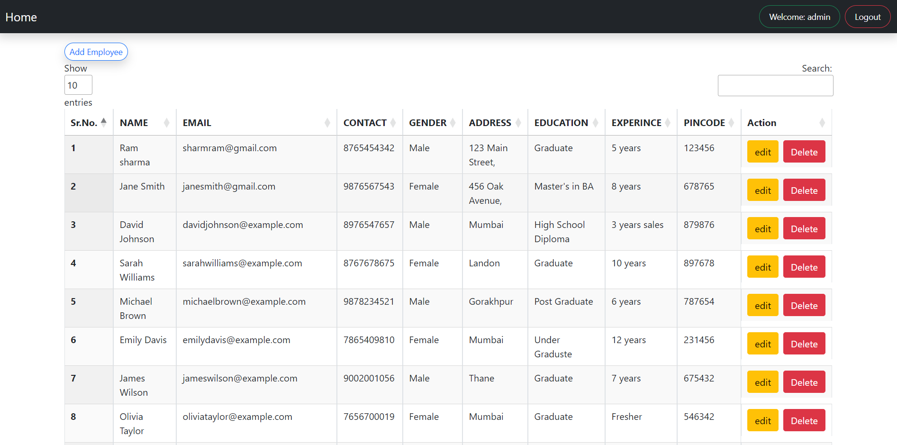
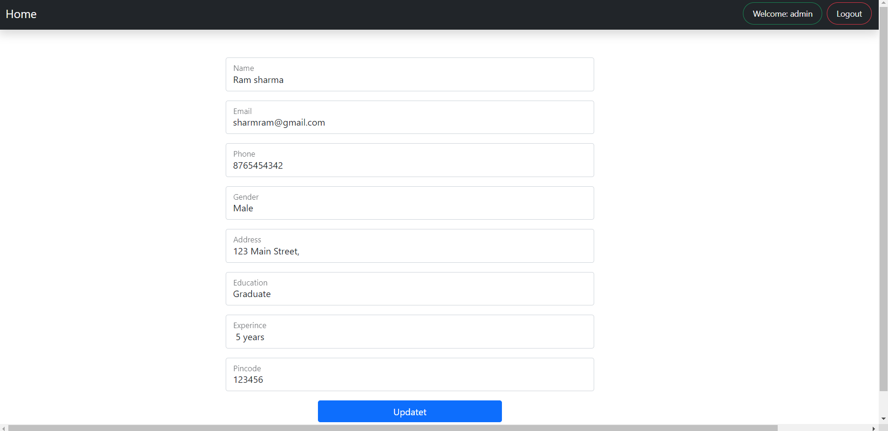

# CRUD Operations with Login module in Python Django and jQuery Data table
 * Project: Employee crud Operation
 * This is a crud operation performed on the employee list.
# Prerequisites:
 * Python installed on your machine (version 3.11.3 )
 * Django framework installed (version 4.2.1 )
 *  Bootstrap, CSS, Jquery,

# Login page 
  *  login functionality 

# Register page 
 * Register functionality
   

# Create Operation
* Creating Employee list Form page hear
* After the User login show this interface  and  show the username in the corner and the logout button

# Read Operation
   * On this page data Fatch in  the database ( Using MySQL database )
   * On this page given all buttons active like,  add employee, edit, delete, and the  Search bar,  on the right side for filtration  data
  

# Update Operation
   * On this page  data  Update  
  
  

# Conclusion

 * I implemented basic CRUD operations using Python Django and jQuery.

 
